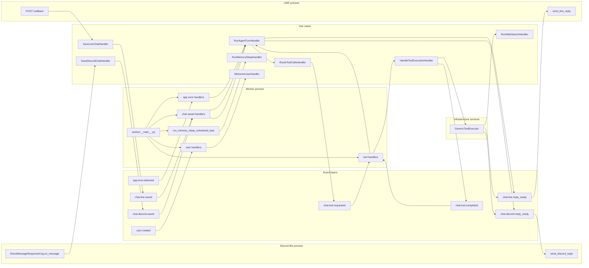
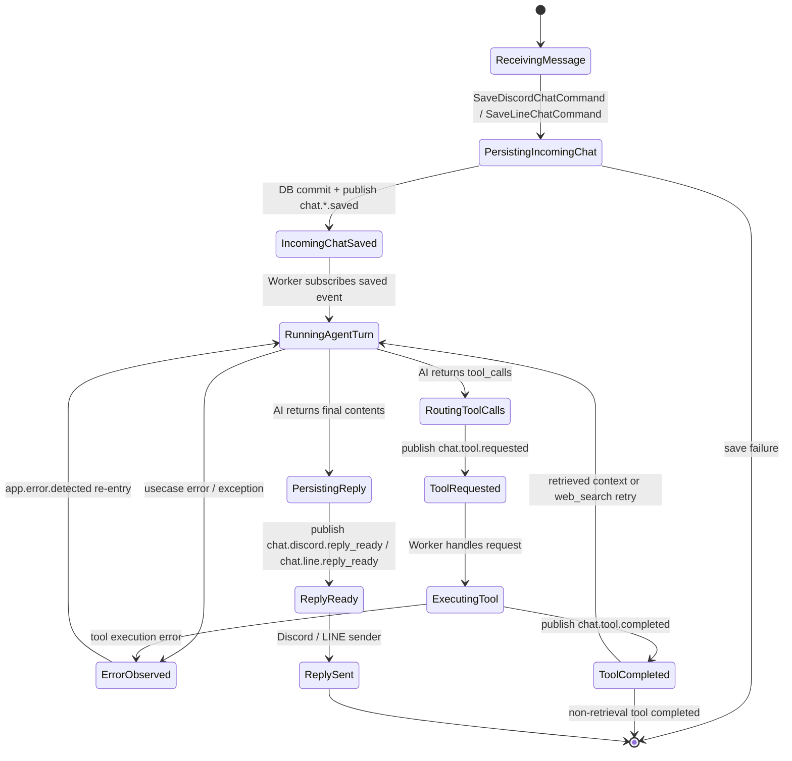

# Event Call Graph

この資料は、現行実装のイベント呼び出し関係をそのまま整理したものです。
対象は `publish` / `subscribe` / `Mediator.send_async(...)` の経路で、旧トピックや廃止済みの流れは含めません。

## 全体像

## 購読関係

Worker は `src/app/presentation/worker/__main__.py` で `app.presentation.worker.handlers` を import し、
`registry.registered_handlers` を `EventBus.subscribe(...)` にそのまま登録します。

| Topic | Subscriber | Next use case |
| --- | --- | --- |
| `chat.discord.saved` | `on_discord_chat_saved` | `RunAgentTurnQuery` |
| `chat.line.saved` | `on_line_chat_saved` | `RunAgentTurnQuery` |
| `chat.tool.requested` | `on_chat_tool_requested` | `HandleToolExecutionCommand` |
| `chat.tool.completed` | `on_chat_tool_completed` | `RunAgentTurnQuery` または終了 |
| `app.error.detected` | `on_app_error_detected` | `RunAgentTurnQuery` または終了 |
| `user.created` | `on_user_created` | `WelcomeUserCommand` |
| `chat.discord.reply_ready` | Discord process の `send_discord_reply` | Discord 送信 |
| `chat.line.reply_ready` | LINE process の `send_line_reply` | LINE 送信 |

`run_memory_sleep_scheduled_task` は EventBus の topic ではなく、Worker 内の定期タスクとして起動されます。

## 発行元

### 1. Discord / LINE の受信

- Discord は `DirectMessageResponseCog.on_message` で `SaveDiscordChatCommand` を実行します。
- LINE は `POST /callback` で `SaveLineChatCommand` を実行します。
- それぞれの UseCase は DB 保存後に `chat.discord.saved` / `chat.line.saved` を publish します。
- Worker は保存イベントを購読し、`RunAgentTurnQuery` を再起動します。

### 2. Agent turn

- `RunAgentTurnHandler` は LLM の応答を生成します。
- 生成結果に tool call がない場合、assistant メッセージを保存したあと `chat.discord.reply_ready` または `chat.line.reply_ready` を publish します。
- tool call がある場合は `RouteToolCallsCommand` に分岐し、reply-ready はこの turn では publish しません。

### 3. Tool routing

- `RouteToolCallsHandler` は検証済み tool call を `chat.tool.requested` に変換します。
- 1 turn で retrieval 系 tool は 1 件までに抑えます。
- `chat.tool.requested` を受けた Worker は `HandleToolExecutionCommand` を実行します。

### 4. Tool execution

- `HandleToolExecutionHandler` は `tool_call_id` で `ToolCall` を `IToolCallStore` から引き、
  `IToolExecutor` を呼び出し、結果の成否に関係なく `chat.tool.completed` を publish します。
- `GenericToolExecutor` は tool の種類ごとに実処理を行います。
- `web_search` と `memory.search` は retrieved context を保存し、後続の `RunAgentTurnQuery` に戻せる形で結果を返します。
- `line.reply` / `discord.reply` / `discord.post_channel` は reply-ready topic を直接 publish します。

### 5. Error observation

- `mediator_observer.install(...)` は `Mediator.send_async(...)` を差し替えます。
- UseCase が例外または `Result` エラーを返すと `app.error.detected` を publish します。
- Worker の `on_app_error_detected` は inference 系の失敗を除き、`RunAgentTurnQuery` を再起動します。

### 6. User onboarding

- `CreateUserHandler` は user 作成後に `user.created` を publish します。
- Worker の `on_user_created` は `WelcomeUserCommand` を実行します。

### 7. Scheduled task

- `run_memory_sleep_scheduled_task` は `MEMORY_SLEEP_INTERVAL_SECONDS` ごとに `RunMemorySleepCommand` を実行します。
- この経路は EventBus を経由しません。

## 主要な再入ループ

### チャット保存から返信まで

1. Discord / LINE の入力を `Save*ChatCommand` が保存する。
2. 保存イベントを Worker が購読する。
3. `RunAgentTurnHandler` が履歴と memory context を参照して応答を作る。
4. tool call が無ければ reply-ready を publish して、各送信側が配信する。
5. tool call があれば `chat.tool.requested` -> `chat.tool.completed` を経由して Agent に戻る。

### Tool completion から Agent への再入

`chat.tool.completed` はすべての tool で再入を起こすわけではありません。

- `web_search` の失敗は `tool_failure_context` を付けて `RunAgentTurnQuery` に戻します。
- `web_search` と `memory.search` の成功は retrieved context を使って `RunAgentTurnQuery` に戻します。
- それ以外の tool 完了はここで終了します。

### App error からの再入

`app.error.detected` は `RetrieveMemoryContextQuery` と `RunAgentTurnQuery` の失敗を除外します。
それ以外の失敗だけを Agent の再入点として扱います。

## 実装メモ

- Worker の handler は `src/app/presentation/worker/handlers/__init__.py` から集約されています。
- `chat.discord.reply_ready` は Discord process のみが購読します。
- `chat.line.reply_ready` は LINE process のみが購読します。
- `RunAgentTurnHandler` と `GenericToolExecutor` の両方が reply-ready topic を publish するため、reply の発火元は 1 箇所ではありません。

## 状態遷移図

以下は、チャット 1 件の処理を状態として見た図です。
`chat.*.saved` を起点に Agent が再入し、tool 実行や reply 送信を経て終了します。

### 補助的な状態

- `user.created` は `CreateUserHandler` から `WelcomeUserCommand` に流れ、チャット返信状態とは独立しています。
- `run_memory_sleep_scheduled_task` は定期実行であり、EventBus の状態遷移には含めません。
