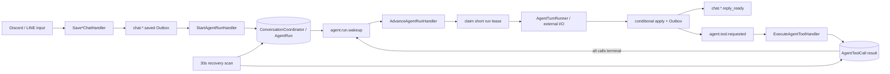

# Event Call Graph

現行の制御フローは、Cloudflare Durable Objects / Workflowsの考え方をPostgreSQL、
Outbox、Worker上で再現する。Redis EventBusは配送を担当するが、進行状態の正本ではない。

## 購読関係

| Topic | Subscriber | UseCase |
| --- | --- | --- |
| `chat.discord.saved` | `on_discord_chat_saved` | `StartAgentRunCommand` |
| `chat.line.saved` | `on_line_chat_saved` | `StartAgentRunCommand` |
| `agent.run.wakeup` | `on_agent_run_wakeup` | `AdvanceAgentRunCommand` |
| `agent.tool.requested` | `on_agent_tool_requested` | `ExecuteAgentToolCommand` |
| `app.error.detected` | `on_app_error_detected` | 観測・ログのみ |
| `chat.discord.reply_ready` | Discord sender | Discord送信 |
| `chat.line.reply_ready` | LINE sender | LINE送信 |

`chat.agent_turn.requested`、`chat.tool.requested`、`chat.tool.completed`は廃止した。
推論の再入やretry判断はイベント連鎖ではなく、永続状態の条件付き遷移が所有する。

## 配送と状態の境界

- saved、wakeup、tool requested、reply readyはすべてtransactional Outboxから発行する。
- wakeupには`agent_run_id + wake_sequence`、tool requestには
  `agent_run_id + tool_call_id + attempt_count`だけを載せる。
- staleまたは重複イベントは、DB上のsequence/status/leaseが一致せずno-opになる。
- 複数toolは同一turnの全行がterminalになった時だけ、最後の完了者がwakeupを作る。
- `app.error.detected`からAgentを再起動しない。retryは`AgentRun.retry_wait`と定期復旧が行う。

詳細な不変条件は[Durable Agent Run](durable-agent-run.md)を参照する。
