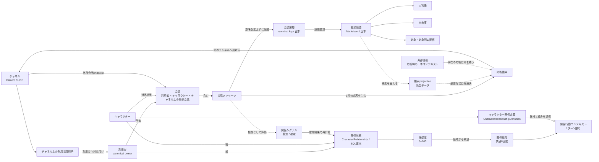
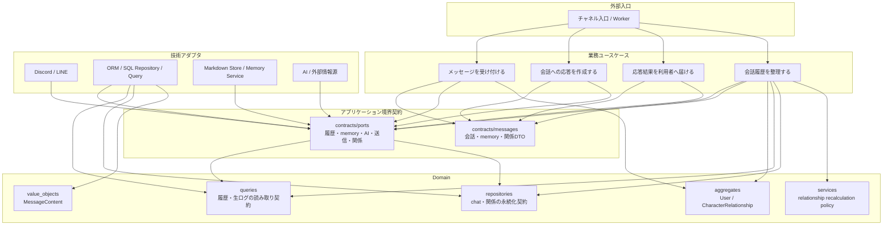
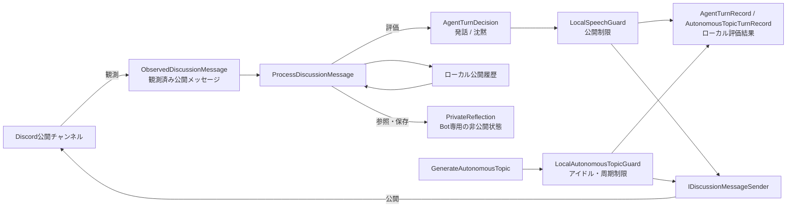

# ドメイン図

最終更新日: 2026-07-16

この文書は、現在の実装と業務上の正本に基づくドメイン概念の関係を示す。業務上の意味は
[ユビキタス言語バンドル](../product/ubiquitous-language/index.md)と
[ユースケース知識バンドル](../product/application-use-cases/index.md)を正本とし、配置と依存方向は
[Domain実装ガイド](./domain-implementation-guide.md)および[アーキテクチャ概要](../architecture/architecture-overview.md)を参照する。
主図は会話・長期記憶・キャラクターとの関係状態からなるcore domainを対象とし、独立したDiscord公開議論の境界は後述する。
長期記憶はcanonical User単位で共有し、会話履歴と関係状態はキャラクターおよびチャネル上の会話単位で分離する。

## 読み方

- 実線は業務上の所有・構成・更新関係を表す。
- 破線は派生データ、応答時だけ存在するデータ、または技術上の参照を表す。
- `domain` に実装された型と、複数レイヤーをまたぐ `contracts` のDTOは同じ図の中でも役割を分けて扱う。
- 図にないTeam、Membership、グループ会話、処理待ち・再処理状態は、このドメインの対象外である。

## 概念モデル

### 正本と派生データ

| 概念 | 正本 | 正本ではないもの |
| --- | --- | --- |
| 会話履歴 | SQLのraw chat log | メモリ用の要約、検索projection |
| 長期記憶 | canonical User単位のMarkdown文書 | SQLのmemory index projection |
| 関係状態 | SQLの`character_relationships`と関係シグナル | Markdown Entity、プロンプト中の推測値 |
| 外部情報 | 保持しない | 現在の応答作成用の一時コンテキスト |

外部情報は取得しただけでは長期記憶にならない。長期記憶は、未整理の会話履歴を
「記憶整理」が意味圧縮した結果である。長期記憶の保存キーはUser単位だが、各raw chatには
根拠となった`character_id`を保持し、キャラクターをまたいだ根拠の追跡を可能にする。
検索projectionは長期記憶から再生成できる派生情報であり、業務上の正本として扱わない。

## 実装境界と依存方向

依存の読み方は次のとおりである。

- UseCaseは外部要求の入口であり、UseCase同士は呼び出さない。
- `contracts/ports` は外部実装とUseCaseの差し替え境界、`contracts/messages` はレイヤー間の共有DTOである。
- `domain/aggregates`、`domain/value_objects`、`domain/services` はORM、SDK、ファイル形式に依存しない。
- `domain/queries` と `domain/repositories` はDomain固有の読み取り・永続化契約であり、実装はInfrastructureに置く。
- AI、チャネルSDK、SQL、Markdownの詳細はInfrastructure側へ閉じ込める。

## 独立したDiscord公開議論

自律的なDiscord公開議論は、1対1会話のドメインモデルとは別のアプリケーションフローである。
各Botは自分専用のローカル履歴と評価状態を持ち、他Botとの共有境界はDiscord公開チャンネルだけである。
このフローはcanonical `User`、1対1の`Conversation`、長期記憶、`CharacterRelationship`を共有しない。

実装上の境界DTOとPortは、それぞれ `contracts/messages/discussion.py` と
`contracts/ports/discussion.py` に置く。ローカル評価結果の`silent`、`proposed`、`published`、
`superseded`、`withheld`、`failed`はこのフローの完了状態であり、core domainの永続的な回復状態ではない。

## 実装型との対応

| 業務概念 | 実装上の代表型 | 配置 | 役割 |
| --- | --- | --- | --- |
| 利用者 | `User` | `domain/aggregates/user.py` | 会話履歴と長期記憶を所有するcanonical owner |
| チャネル上の利用者識別子 | `UserChannelIdentity` | `domain/aggregates/user.py` | Discord/LINEの外部IDをUserへ対応付ける値 |
| キャラクター | `CharacterDefinition` | `contracts/messages/character_definition.py` | 組み込みキャラクターの安定メタデータ |
| 会話の入力・受付・応答 | `IncomingMessage`, `AcceptedMessage`, `ConversationResult`, `DeliveryResult` | `contracts/messages/conversation.py` | UseCase間で渡す会話DTO |
| 会話の識別境界 | `ConversationScope` | `domain/value_objects/conversation_scope.py` | 利用者・キャラクター・チャネル・外部会話IDを正規化する値 |
| メッセージ内容 | `MessageContent`, `MessageContentType` | `domain/value_objects/message_content.py` | 非空TEXTと永続化表現を検証・変換する値 |
| 会話履歴 | `IChatHistoryQuery`, `IRawChatLogQuery`, `IChatRecordRepository` | `domain/queries`, `domain/repositories` | 会話履歴の読み取り・書き込み境界 |
| 長期記憶 | `MemoryProfile`, `MemoryTimelineEntry`, `MemoryEntity`, `MemoryContextPack` | `contracts/messages/memory_context.py` | 応答作成へ渡すuser-scoped memory DTO |
| 関係状態 | `CharacterRelationship` | `domain/aggregates/character_relationship.py` | character × user単位の好感度スナップショット |
| 関係段階 | `RelationshipStageId`, `RelationshipStageRange`, `resolve_relationship_stage` | `domain/aggregates/character_relationship.py` | 好感度を共通8段階へ写像 |
| キャラクター関係定義 | `CharacterRelationshipDefinition` | `contracts/messages/relationship.py` | 段階ごとの行動候補とシグナル差分 |
| 関係シグナル | `RelationshipSignalCandidate`, `PersistedRelationshipSignal` | `contracts/messages/relationship.py` | AI評価候補とSQL保存イベント |
| 関係永続化 | `ICharacterRelationshipRepository` | `domain/repositories/interfaces.py` | 暫定シグナル保存と確定シグナル照合 |

`Conversation`、`LongTermMemory`、`Character` は業務上の概念として図に現れるが、現行コードでは
それぞれ一つのDomain集約クラスへまとめていない。会話・memoryの境界DTOと、キャラクター定義の設定型で
表現している。図の概念名だけから未実装の集約や汎用Repositoryを追加してはならない。

## 不変条件と状態更新

### 利用者と会話

- `User.id` は26文字のULIDである。
- Userは少なくとも一つの `UserChannelIdentity` を持ち、同じ外部IDの重複を許さない。
- チャネル上の利用者識別子をcanonical Userへ解決できないメッセージは、受付済みにならない。
- 会話履歴・長期記憶はcanonical `user_id`でスコープし、チャネルの生IDを所有者として扱わない。

### 長期記憶

- 記憶は人物像、出来事、対象・対象間の関係に分けて扱う。
- 各記憶は根拠と不確実性を持ち、判断できない内容は確定せず保留する。
- `TEXT` メッセージの永続化payloadは `{"texts": ["..."]}` 形式であり、`payload.text` は使用しない。非テキスト入力は対象外である。
- 記憶の書き込みは「会話履歴を整理する」に集約し、応答中の外部情報を直接記憶へ保存しない。

### 関係状態

- `CharacterRelationship` は `(character_id, user_id)` の組ごとに一つの状態を持つ。
- 好感度は `0`–`100`、初期値は `0`、versionは `1`以上である。
- 関係段階の範囲はDomainで固定する。キャラクター定義は段階ごとの表現と行動候補を提供する。
- 応答時は更新前の関係状態から一つの関係行動コンテキストを選ぶ。
- 応答と並行する評価は暫定シグナルとして扱い、日次の記憶整理で会話全体を根拠に確定シグナルへ照合する。
- 日次の関係状態更新と会話履歴の処理済み記録は、同じUnit of Workのトランザクションで確定する。

## 関連資料

- [利用者と会話](../product/ubiquitous-language/conversation.md)
- [外部情報と長期記憶](../product/ubiquitous-language/memory.md)
- [対話相手との関係状態](../product/ubiquitous-language/relationship.md)
- [Memory Write Flow](../infrastructure/memory-write-flow.md)
- [Relationship System](../infrastructure/relationship-system.md)
- [User Identity Mapping](../infrastructure/user-identity-mapping.md)
- [Discord公開議論の業務境界](../product/discussion/index.md)
