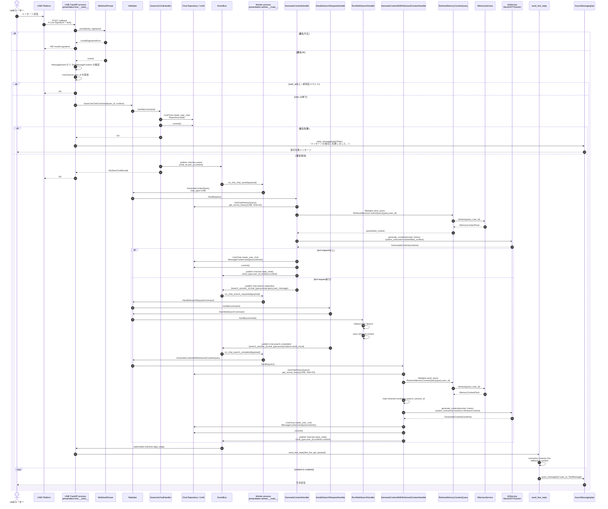

# LINE メッセージフロー

このドキュメントは、LINE webhook 受信から生成返信の送信までの現行実装
フローを示す。実装上の境界は次の通り。

- LINE FastAPI process は webhook を受け取り、LINE 返信イベントも購読する。
- Worker process は保存済み LINE メッセージイベントを購読し、返信生成を起動する。
- 生成処理は `RetrieveMemoryContextQuery` 経由で記憶コンテキストを取得する。
- 検索が必要な場合は `chat.search.requested` / `chat.search.completed` を介して
  短期検索 workflow に分岐し、再推論時に `retrieved context` を追加する。
- reply-ready payload は `contents` を一次情報とし、`content` は互換用の結合値として扱う。
- 複数 process 構成では process 内メモリの EventBus では届かないため、共有 EventBus provider を使う。

## EventBus provider の注意点

LINE flow は少なくとも LINE FastAPI process と Worker process に分かれる。`chat.line.saved`
は LINE process から publish され、Worker process が購読する。`chat.line.reply_ready`
は Worker process から publish され、LINE process が購読して `send_line_reply` を実行する。

このため、複数 process で動かす環境では `EVENT_BUS_PROVIDER=redis` または
`EVENT_BUS_PROVIDER=postgres` のように process 間で共有できる provider を設定する。
`memory` provider は同一 process 内でしかイベントを配送できないため、LINE と Worker を
別 process で起動すると保存イベントや返信準備イベントが相手 process に届かない。

`REDIS_URL` が設定されている場合は Redis provider が優先され、PostgreSQL の
`DATABASE_URL` が設定されている場合は Postgres provider が選ばれる。明示する場合は
`EVENT_BUS_PROVIDER` を設定して、LINE process と Worker process で同じ provider と
接続先を使う。
