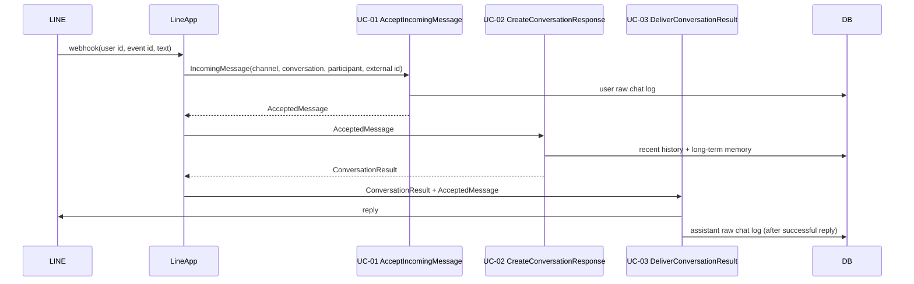

# LINE Message Flow

LINE webhookはチャネル固有のpayloadを共通メッセージへ変換し、3つの会話UseCaseを
同じリクエスト処理内で呼び出す。

LINE 1:1の会話識別子は`userId`、受信メッセージの重複判定には`webhookEventId`を使う。
Redis、outbox、AgentRun、lease、retry、recoveryはこのフローの前提にしない。
