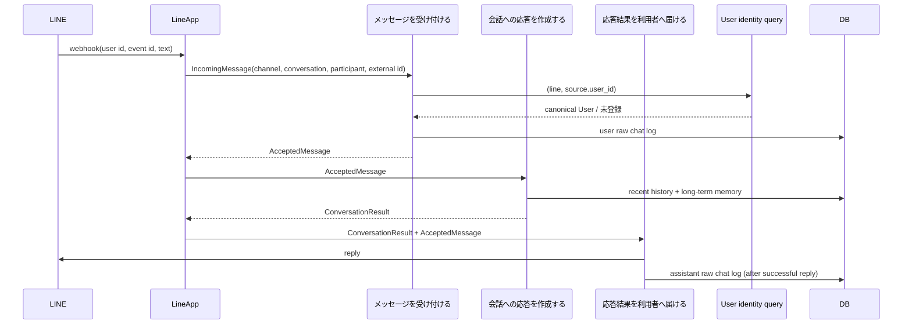

# LINE Message Flow

> 本書はLINE固有の入力変換と結果通知を扱う技術リファレンスである。業務上の受付・応答・通知の意味は
> [ユースケース](../product/application-use-cases/index.md)を正本とする。

LINE webhookはチャネル固有のpayloadを共通メッセージへ変換し、3つの会話ユースケースを
同じリクエスト処理内で呼び出す。

LINE 1:1の会話識別子は`userId`、受信メッセージの重複判定には`webhookEventId`を使う。
`source.user_id`が`user_channel_identities`に未登録なら、raw chat保存前に受付を失敗させる。
Redis、outbox、AgentRun、lease、永続的なretry/recovery状態はこのフローの前提にしない。
