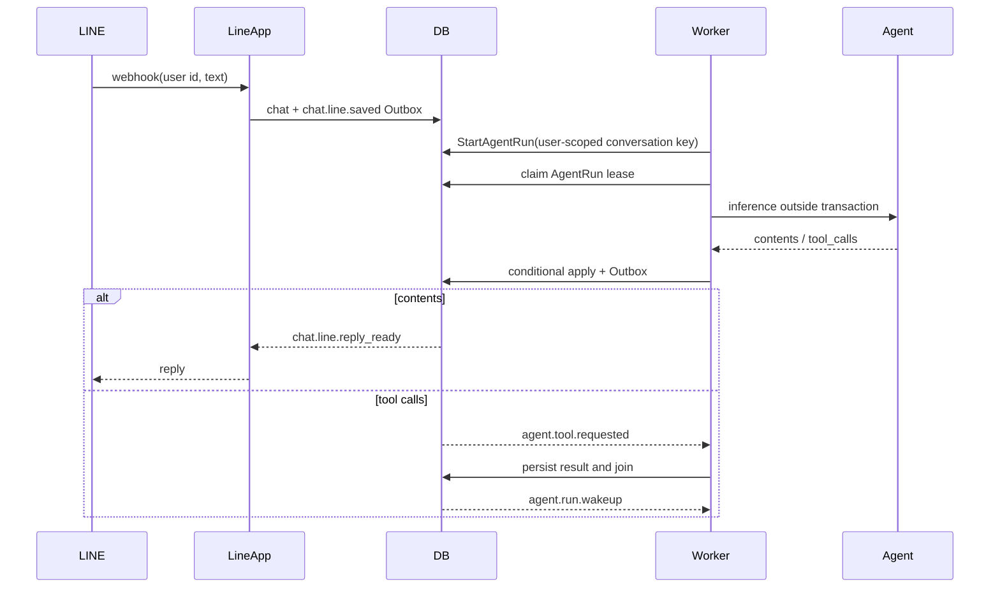

# LINE Message Flow

```mermaid
sequenceDiagram
    participant LINE
    participant LineApp
    participant DB
    participant Worker
    participant Agent

    LINE->>LineApp: webhook(user id, text)
    LineApp->>DB: chat + chat.line.saved Outbox
    Worker->>DB: StartAgentRun(user-scoped conversation key)
    Worker->>DB: claim AgentRun lease
    Worker->>Agent: inference outside transaction
    Agent-->>Worker: contents / tool_calls
    Worker->>DB: conditional apply + Outbox
    alt contents
        DB-->>LineApp: chat.line.reply_ready
        LineApp-->>LINE: reply
    else tool calls
        DB-->>Worker: agent.tool.requested
        Worker->>DB: persist result and join
        DB-->>Worker: agent.run.wakeup
    end
```

LINE 1:1のconversation keyは`character_id + LINE + user_id`であり、messageごとのchat idでは
ない。reply先channelもuser idを使う。制御状態はPostgreSQL、Redisはevent transportである。
