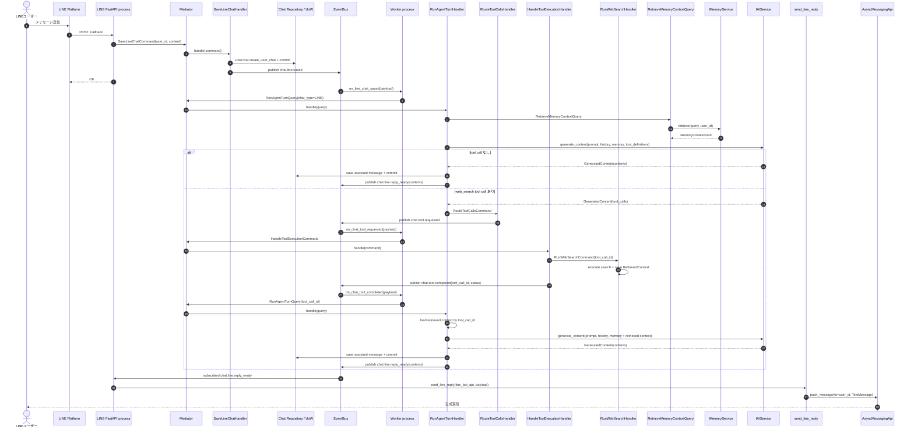

# LINE メッセージフロー

このドキュメントは、LINE webhook 受信から生成返信の送信までの現行実装
フローを示す。

- LINE FastAPI process は webhook を受け取り、LINE 返信イベントも購読する。
- Worker process は保存済み LINE メッセージイベントを購読し、`RunAgentTurnQuery` を起動する。
- 生成処理は `RetrieveMemoryContextQuery` 経由で記憶コンテキストを取得する。
- 検索が必要な場合も `chat.tool.requested` / `chat.tool.completed` を介する。
- `chat.tool.requested` は `tool_call_id` と `tool_name` を持ち、実際の `ToolCall` は
  `IToolCallStore` 経由で Worker 側が取り出す。
- retrieved context は `tool_call_id` をキーに短期 store へ保存し、再推論時に追加する。
- retrieved context を返す tool call は 1 turn につき 1 件までに抑える。
- reply-ready payload は `contents` を一次情報とする。送信側は `contents` を正として扱い、
  `content` のフォールバックには依存しない。

## EventBus provider の注意点

LINE flow は少なくとも LINE FastAPI process と Worker process に分かれる。`chat.line.saved`
は LINE process から publish され、Worker process が購読する。`chat.line.reply_ready`
は Worker process から publish され、LINE process が購読して `send_line_reply` を実行する。

複数 process で動かす環境では `EVENT_BUS_PROVIDER=redis` または
`EVENT_BUS_PROVIDER=postgres` のように process 間で共有できる provider を設定する。
`memory` provider は同一 process 内でしかイベントを配送できない。
