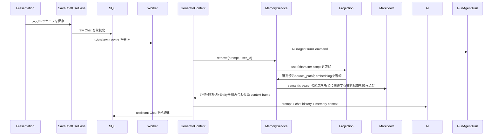
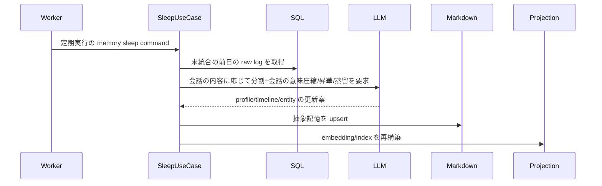

# 長期記憶の目標アーキテクチャ

この文書は、長期記憶システムの完成形を定義する。今後の実装作業は
この設計を目標状態として進める。

## 要約

長期記憶は、未加工の事実、抽象化された記憶、検索インデックスを分離する。

- 生のチャットログは SQL データベースを正とする。
- Markdown は Profile、Timeline 要約、Entity などの抽象化された長期記憶のみを保持する。
- raw Timeline Markdown は legacy、手動投入、または移行中の暫定データとして扱い、chat raw の正本にしない。
- 検索用インデックスは main SQL database の migration 管理された projection に置く。
- 定期処理は worker の scheduled task で睡眠・統合ジョブとして実行する。
- Chat 生成は `IMemoryService` 経由で組み立て済みの memory context を取得するだけにし、保存方式の詳細を知らない。

これにより、Markdown を 抽象度の高い情報の永続層（記憶領域）として使用する。

## 設計原則

- raw ログは運用データであり SQL が責務を持つ。
- Markdown はLLMによって概要の抽出や会話内容(複数ターン)をベースに蒸留を行った情報の永続記憶に使う。
- 検索インデックスは再構築可能な派生物であり、正本ではない。
- worker は定期的な処理の実行を担当し、実行されるUseCase経由で睡眠・保守処理を担う。
- UseCase は port と Mediator を通じて記憶へアクセスする。
- presentation 層は memory を直接読み書きしない。
- いかなる memory 層も `user_id` の境界を越えて漏れてはならない。（他ユーザーとの記憶の流出防止）
- 検索 workflow の短期結果は memory ではなく別系統の一時状態として扱う。

## 現在の実装棚卸し

この節は目標状態ではなく、移行履歴と現状把握のための棚卸しである。

- raw chat の正本は SQL に寄せる方針で、Markdown raw Timeline は最終保存先ではない。
- 日次・睡眠後の要約は、まだ deterministic summary / deterministic consolidation の性格が残っている。LLM ベースの意味圧縮は目標状態である。
- 検索は main DB projection と deterministic/embedding score を組み合わせる。
- sleep 後のMarkdown更新はprojection rebuildへ同期接続され、Worker起動時にも全体rebuildする。
- `source_chat_ids` は SQL raw chat row の根拠を表し、現行の section summary writer は
  `summary_of` にも raw chat IDs を入れている。target-state では
  `summary_of` を Markdown Timeline summary 同士の再要約・継承関係のみに
  限定したい。
- agent profile は `memory/profiles/agent/<character_id>/...` に namespaced で保存され、flat path は legacy fallback として残っている。
- worker の scheduled task は `schedule_run_time` を受け取り、`memory_sleep` は 3時に整列して起動する現行実装になっている。

## Search workflow との境界

検索は長期記憶 retrieval とは別の経路で扱う。

- 長期記憶 retrieval は `IMemoryService` の責務。
- 外部検索結果の受け渡しは `tool_call_id` をキーにした短期 tool result state の責務。
- 検索結果は raw のまま Markdown に昇格させない。
- 長期記憶に入れるのは、検索結果から抽出・要約された durable fact のみである。

## 保存責務

### SQL データベース: raw ログの正本

SQL データベースは raw チャットメッセージの正本である。
`src\app\domain\aggregates\chat.py`とその派生クラス。

責務:

- ユーザーとアシスタントの全メッセージを保存する。
- channel、guild、LINE user、timestamp、本文を保持する。
- 記憶抽象化の再実行に必要な入力を提供する。
- 睡眠・統合ジョブの材料を供給する。

現在の主な入口:

- `Chat` aggregate と `ChatORM`
- 直近会話を読む `Chat history query`

追加が必要な機能:

- 睡眠ジョブ用の raw ログ取得 Query
- 1日以上前の chat row は記憶への昇華済みと判断（逆にその日のchat rawはコンテキストウインドウ以上肥大化しない限りコンテキストとして直接渡す想定）
- `memory_sleep` は実行台帳を持たず、raw chat の再処理を許容する

raw SQL ログは、抽象化された場合を除いて Markdown に二重保存しない。
raw Timeline Markdown が残る場合も、legacy/manual/暫定データとして読み取り互換の範囲に閉じる。

### Markdown: 抽象長期記憶

Markdown は人間が読める長期記憶の本体である。

保持するのは次のみ:

- Profile: ユーザー・エージェント属性
- Timeline: 日次または周期的な意味圧縮要約
- Entity: 正規化された事実、未解決プレースホルダー、対象の状態

Markdown が答えるべき問い:

- どんな恒常的な事実を知っているか
- 時間とともに何が変化したか、いつの出来事か
- どの Entity がまだ未解決か
- どの SQL chat row や要約がこの記憶の根拠か

Markdown に保存しないもの:

- raw チャットメッセージ全件
- assistant の全応答
- 一時的な検索候補
- embedding や vector index の内部情報
- 記憶の必要がない会話（挨拶、お礼など）
- chat raw の正本としての raw Timeline Markdown

### Main DB Index Projection: 再構築可能な検索投影

検索インデックスはmain application databaseの`memory_index_documents`に保存する。SQLite/Postgresのどちらでも同じprojection契約を使い、専用index databaseは作らない。

インデックスは Markdown 記憶と選択された SQL raw log の投影であり、正本から再構築可能である。
vector backendを将来変更する場合も、main DB projectionを迂回するfallbackではなく`IMemoryIndexQuery`実装の置換として扱う。

責務:

- Profile、Timeline 要約、Entity 文書の embedding を保持する
- semantic retrieval を支える
- user、memory type、status、tags、date で十分に絞り込める metadata を持つ
- embedding が無い場合の deterministic な lexical fallback を支える

vector index を正本として扱ってはならない。

## 目標データフロー

### 通常の会話フロー



重要な区別:

- 直近の会話継続に必要な chat history は SQL から読む。
- 長期記憶の文脈は Markdown + vector index から読む。

### 睡眠フロー



睡眠処理は冪等でなければならない。失敗時に Markdown を壊したり、会話に出た同じEntityに対して複数Entityの登録等をしてはならない。

## Worker 統合

worker には scheduled task の仕組みがあり、`schedule_run_time` を付けた task は
初回実行を時刻に合わせられる。`memory_sleep` はこの仕組みをすでに使っている。

- `src/app/presentation/worker/registry.py`
- `src/app/presentation/worker/handlers.py`
- `src/app/presentation/worker/__main__.py`

推奨 use case:

- `RunMemorySleepCommand`: 定期実行の最上位ジョブ
- `ConsolidateUserMemoryCommand`: 1ユーザー・1日分の統合
- `RebuildMemoryIndexCommand`: Markdown から embedding/index を再構築
- `RepairMemoryIndexCommand`: 古い index row の検出と修復

worker はジョブの起動だけを担当する。Markdown のパース、vector 検索、SQL 永続化の直接操作はしない。

## 意味圧縮

日次サマリーは deterministic な連結ではなく、意味圧縮とする。

入力:

- あるユーザーと時間範囲に対する SQL raw chat log
- 既存の user Profile
- 既知または意味的に一致した Entity
- 既存の日次 Timeline 要約

出力:

- 日次 Timeline Markdown 要約
- 解決済みまたは未解決の Entity upsert
- 必要なら Profile 更新案
- 元の SQL chat ID を指す統合メタデータ

LLM 出力は構造化スキーマで制約し、保存前に検証する:

- Timeline front matter
- Entity front matter
- Profile patch
- 参照元 SQL chat ID

意味圧縮では不確実性を保持する:

- `status: unresolved` を使う
- `missing_attributes` を使う
- manufacturer、model、date、preferences を勝手に補完しない
- 参照元 SQL chat ID を残す

## 目標 Markdown スコープ

### Profile

Profile は安定属性だけを保持する。もしくは睡眠フローより長周期の定期処理によって記憶領域からProfileとして永続化する内容を蒸留。

例:

- ユーザーの応答スタイル
- 恒常的な制約
- エージェント人格
- 長期的な嗜好

可能なら Profile には Timeline 要約または SQL chat ID への参照を持たせる。

### Timeline

Timeline は意味圧縮された要約を保持する。

目標パス:

```text
memory/timeline/<user_scope>/daily/YYYY/MM/YYYY-MM-DD_<chat_content_title>.md
```

Timeline は chat message ごとの raw ファイルを持たない。
会話に対して「何に対して話した」「どういう結論になった」「どういう感情を抱いたか」「返答に対する相手の反応がどうだったか」などを記録

必要な参照:

- `source_chat_ids`: その section の要約に含めた SQL chat ID。日全体ではなく section ごとに保持する
- `entity_ids`: 関連 Entity ID
- `summary_of`: 再要約した Markdown Timeline summary ID。SQL chat ID は入れない

参照方針:

- SQL raw chat row を根拠にするときは `source_chat_ids` を使う。
- Markdown Timeline summary を再要約、統合、または置換するときは `summary_of` を使う。
- Entity の `referenced_in` は原則として Timeline summary ID を指し、直接 SQL 根拠を残す必要がある場合だけ `source_chat_ids` を併用する。
- raw Timeline Markdown は legacy/manual/暫定データなので、通常の参照先として増やさない。

### Entity

Entity は正規化された状態を保持する。

例:

- Project
- 物理オブジェクト
    - 購入した商品
    - 好きなもの
    - 今持っているもの
- 人物
- キャラクター
- 未解決プレースホルダー
    - 机が欲しい⇒"欲しい机"(机の要件が未解決)

Entity が持つべきもの:

- `properties`
- `missing_attributes`
- `referenced_in`
- `source_chat_ids`
- `status`
- `last_observed_at`
- `maker`
- etc...

## Main DB Vector Search 設計

### データベース所有

memory indexing は main application database の `memory_index_documents` projection を使う。スキーマは Alembic migration で管理し、専用 sidecar database は持たない。

推奨:

- raw chat は main app SQL database に保持する
- local SQLite と production Postgres のどちらでも main DB projection を唯一の read path とする
- 将来 vector backend を変更する場合も `IMemoryIndexQuery` の実装差し替えとして扱う

### テーブル

metadata table の論理例:

```sql
create table memory_index_documents (
  source_path text primary key,
  user_id text,
  memory_type text not null,
  source_id text not null,
  title text,
  content_hash text not null,
  indexed_text text not null,
  tags_json text not null,
  status text,
  timeline_type text,
  occurred_at text,
  updated_at text not null,
  importance real not null,
  confidence real not null,
  decay_score real not null,
  embedding json not null
);
```

### Retrieval

retrieval は次を組み合わせる:

- user scope filter
- memory type/status/tags/date filters
- projectionに保存されたembeddingによるsemantic score
- lexical fallback score
- importance/confidence/decay score
- pinned / unresolved のブースト

目標スコア:

```text
final_score =
  semantic_score * semantic_weight
  + lexical_score * lexical_weight
  + importance_boost
  + confidence_boost
  + recency_or_decay_boost
  + unresolved_boost
```

### Embedding Provider

memory indexing を特定 AI provider に直結させず、embedding port を追加する。

推奨契約:

```python
class IEmbeddingService(ABC):
    async def embed_texts(
        self,
        texts: list[str],
    ) -> Result[list[list[float]], EmbeddingServiceError]:
        ...
```

実装候補:

- OpenAI embeddings
- Gemini embeddings
- 将来的な local embedding model
- テスト用 deterministic fake embeddings

## Port と Use Case

### Ports

推奨 port:

- `IMemoryService`: 組み立て済み context を返す
- `IMemoryStore`: 抽象 Markdown の read/write
- `IMemoryIndexQuery`: main DB projection から検索対象を取得する
- `IMemoryIndexMaintenance`: projection の rebuild / repair
- `IEmbeddingService`: embedding 生成
- `IRawChatLogQuery`: 統合用の SQL raw log 取得
- `IMemoryConsolidationService`: LLM ベースの意味圧縮

### Use Case

推奨 use case:

- `RunMemorySleepCommand`
- `ConsolidateDailyMemoryCommand`
- `UpsertEntityMemoryCommand`
- `UpdateProfileMemoryCommand`
- `RebuildMemoryIndexCommand`
- `RepairMemoryIndexCommand`

`RunAgentTurnHandler` は単一の retrieval boundary を通すだけにし、SQLite、Markdown、embedding の詳細を知らないようにする。

## 冪等性と一貫性

sleep jobs は retry 可能でなければならない。

ルール:

- consolidation run ID を使う
- raw SQL log は安定した chat ID で選ぶ
- Markdown は一時ファイルに書き、atomic replace する
- vector index row は `content_hash` で upsert する
- Markdown と index の書き込みが成功してから SQL log を統合済みにする
- vector index は Markdown からいつでも再構築できる

推奨 job state:

- `pending`
- `processing`
- `complete`
- `failed`
- `skipped`

## 現在実装からの移行

現在の実装にはすでに役立つ要素がある:

- Markdown parser/store
- user-scoped layout
- context frame DTO
- main DB projection を使う deterministic search / keyword index
- deterministic summary / deterministic consolidation helper
- worker scheduled task registry
- SQL raw log selection の入口

未完了または移行中の点:

- raw Timeline Markdown を正本扱いしない方針への整理
- sleep 入力を SQL raw chat log に寄せ切ること
- sleep 後の Markdown 更新を index 更新と retrieval に接続すること
- deterministic summary を LLM ベースの意味圧縮へ置き換えること
- main DB projection の embedding を利用したsemantic retrievalを強化すること

目標への移行:

1. raw Timeline Markdown を legacy/manual/暫定データとして扱い、最終保存先から外す
2. raw chat の正本を SQL chat row として明確化する
3. sleep の入力を raw Markdown ではなく SQL chat row に統一する
4. 日次サマリーを deterministic 連結から LLM ベースの意味圧縮へ変える
5. `IEmbeddingService` を追加する
6. main DB projection のembedding検索をprovider非依存にする
7. retrieval は vector search を主、lexical scoring を補助にする
8. `RunMemorySleepCommand` は worker scheduled task に接続済み。必要なら
   既存の `schedule_run_time` を含めて運用仕様を詰める
9. sleep 後の Markdown upsert と index upsert / rebuild / repair command を接続する
10. SQL ベースの sleep が安定したら raw Markdown timeline writing を削除またはアーカイブする

## テスト戦略

単体テスト:

- Markdown schema validation
- SQL raw log query selection
- fake LLM を使った semantic compression の出力検証
- Entity upsert と unresolved handling
- deterministic fake embeddings を使った vector index search
- context frame assembly

統合テスト:

- SQL に chat を保存し、sleep を実行して Markdown summary を確認する
- index rebuild を実行し、vector row が存在することを確認する
- prompt 用 context を取得し、source-scoped memory が返ることを確認する
- worker scheduled task が Mediator command を呼ぶことを確認する

安全性テスト:

- cross-user memory leakage が起こらない
- compression 失敗で SQL log が誤って統合済みにならない
- sleep の再実行が冪等
- 壊れた Markdown は `MemoryServiceError` になる
- vector extension が無い場合は明示的な設定エラー、または環境ポリシーに応じた fallback になる

## 他決定事項

- embedding provider と embedding dimension
    - 一旦以下を使用
    - `https://ai.google.dev/gemini-api/docs/embeddings?hl=ja`
    - `https://developers.openai.com/api/docs/guides/embeddings`
- local development と production の双方で main app DB を使い、専用 index DB は作らない
- production の Postgres では`pgvector`の使用もしくは別のベクトル検索に特化したDBの採用を検討
- semantic compression が Profile を自動更新するか、レビュー用 proposal を先に書くか
    - YAGNI
- worker sleep の実行間隔
    - １日おき、深夜3時
- 障害復旧時にどこまで遡って sleep するか
    - 現状のmemoryをチェックして日付を決定
    - 作成途中で落ちているようであればその日を一旦削除して再実行する
    - 復旧用のフローは通常フローとは別で実装(責務に応じて実装する。不変のロジック以外の共通化はNG)
