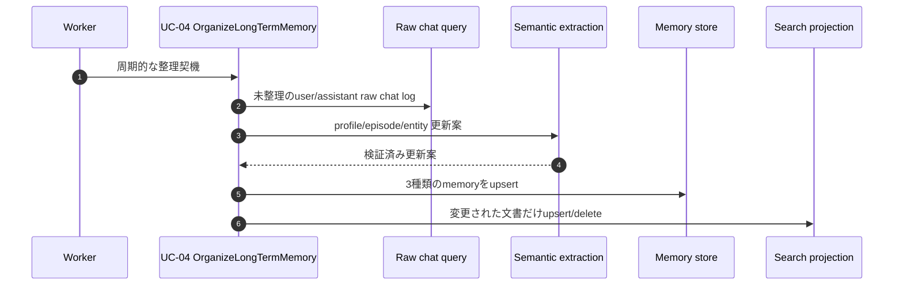

# Memory Write Flow

長期記憶の書き込みはUC-04「会話から長期記憶を整理する」に集約する。
会話応答中に長期記憶を直接更新したり、tool callの実行状態を永続化したりしない。

## 周期的な記憶整理

## 実装上の境界

- Workerは定期的にUC-04を起動するだけで、memory storageを直接操作しない。
- UC-04はraw chat logを読み、profile、episode、entity/relationshipを一度の整理処理で更新する。
- assistantのraw chat logはUC-03のチャネル配信成功後に追加される。
- projectionはmemory documentの変更分だけ更新する。全件rebuild、repair、backup、起動時再構築は行わない。
- 整理に失敗した回はその場で失敗として確定し、自動retryや永続待機を行わない。

## 読み取りとの分離

- 応答作成: `CreateConversationResponse` -> `ConversationContext` -> memory read
- 記憶更新: `OrganizeLongTermMemory` -> raw chat query -> `MemoryConsolidator`
- presentation層はmemory storageを直接参照しない。
