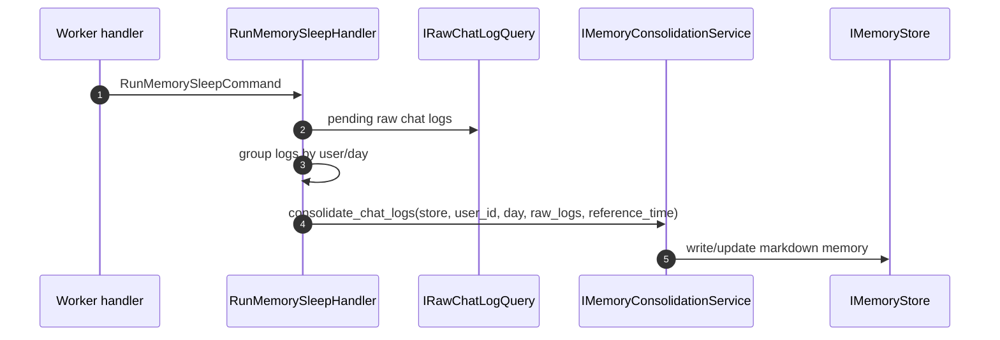

# Memory Write Flow

この文書は、現在の memory 更新経路をまとめる。

## 現行の書き込み経路

現行コードで実際に動いている memory 更新は、次の 2 系統である。

1. `memory.sleep` による sleep / consolidation
2. `memory.write_candidate` による raw Timeline 書き込み

`RunAgentTurnHandler` は memory を読むだけで、長期記憶の書き込みはしない。

## sleep / consolidation

### 実装上の入口

- worker 側の入口は [run_memory_sleep_scheduled_task](../../src/app/presentation/worker/handlers/memory_sleep_handlers.py)
- そこから [RunMemorySleepHandler](../../src/app/usecases/memory/run_memory_sleep.py) を呼ぶ
- `RunMemorySleepHandler` は [IRawChatLogQuery](../../src/app/domain/queries/raw_chat_log_query.py) を使って対象ログを選ぶ
- 意味圧縮と memory 更新は [IMemoryConsolidationService](../../src/app/contracts/ports/memory_consolidation.py) に委譲する

## raw Timeline 書き込み

`memory.write_candidate` は、現行実装では [FilesystemMemoryWriteService.add_log](../../src/app/infrastructure/services/memory_write_service.py) を通じて
raw Timeline Markdown を書く。

これは long-term memory の目標状態とは一致していないが、現在の tool flow ではまだ残っている。

### flow

1. `GenericToolExecutor` が `memory.write_candidate` を受ける
2. `IMemoryWriteService.add_log(...)` を呼ぶ
3. `FilesystemMemoryWriteService` が `timeline_type: "raw"` の Markdown を保存する

## 読み取りとの分離

- read: `RunAgentTurnHandler` -> `RetrieveMemoryContextQuery` -> `IMemoryService.retrieve(...)`
- write: `memory.sleep` -> `RunMemorySleepHandler` -> `IMemoryConsolidationService.consolidate_chat_logs(...)`
- candidate write: `GenericToolExecutor` -> `IMemoryWriteService.add_log(...)`

## 補足

- presentation 層は memory storage を直接操作しない
- `FilesystemAgentProfileService` は agent profile を自動生成しない。存在確認と読み込みのみを行う
- worker の scheduled task は `schedule_run_time` を持ち、実行時刻の揃え込みをサポートする
