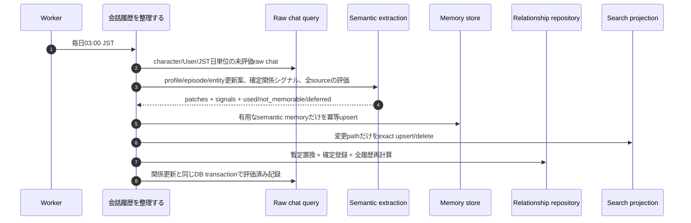

# Memory Write Flow

> 本書は長期記憶の技術的な実行フローを示す。記憶の意味と判断基準は
> [ユビキタス言語](../product/ubiquitous-language/index.md)と[ユースケース](../product/application-use-cases/index.md)を正本とする。

保存形式は[Memory Markdown Schema バンドル](memory-markdown-schema/index.md)を参照する。

長期記憶の書き込みと確定関係シグナルの照合は「会話履歴を整理する」だけが行う。
会話中の書き込みtoolやraw Timeline候補は持たず、SQL raw chat logを唯一の入力正本とする。

## 周期的な記憶整理

## 実装上の境界

- Workerは定期的に会話履歴整理を起動するだけで、memory storageや関係Repositoryを直接操作しない。
- 会話履歴整理はraw chat logを読み、profile、episode、entity更新案と確定関係シグナルを一度の抽出で得る。
- 関係シグナルはSQLの関係集約へ保存し、Markdown Entityには保存しない。
- 対象chatは`character_id`で分離し、別キャラクターの履歴、シグナル、関係状態を混ぜない。
- すべてのraw chatを`used`、`not_memorable`、`deferred`のいずれかに分類する。前二者だけを評価済みにし、
  `deferred`は次回へ残す。
- 記憶すべき内容がない日はMarkdownを増やさず、sourceだけを評価済みにする。
- assistantのraw chat logは「応答結果を利用者へ届ける」のチャネル配信成功後に追加される。
- 長期記憶はcanonical User単位で共有するが、抽出入力の各raw chatには`character_id`を残し、根拠となったキャラクターを追跡できるようにする。
- projectionは変更された文書pathだけを更新する。全件rebuild、repair、backup、起動時再構築は行わない。
- 外部サービスへの一時的な再試行は、技術アダプタの内部方針として扱い、記憶整理の業務結果には含めない。
- memory更新または関係状態更新が失敗したchatは評価済みにせず、冪等な再実行対象として残す。
- 実行数や排他制御などの運用条件は、実行環境とコードの設定を正本とする。

## 更新判断

- 現在の嗜好・属性の訂正は`replace`とし、誤っていた旧値を残さない。
- 勤務先など時間経過による状態変化は`transition`とし、旧値を`property_history`へ残す。
- 訂正か時間変化か判断できなければ`defer`し、確定情報として書かない。
- episode IDはJST日とsource chat ID集合、entity IDは種別と正規化labelから決定する。同じ入力の再実行で
  LLMの文面が変わっても、意味的に同じ記憶を重複作成しない。

## 読み取りとの分離

- 応答作成: `CreateConversationResponse` -> `ConversationContext` -> memory read
- 記憶更新: `ConsolidateConversationHistory` -> raw chat query -> `MemoryConsolidator`
- 関係確定: `ConsolidateConversationHistory` -> `ICharacterRelationshipRepository.reconcile_confirmed`
- presentation層はmemory storageを直接参照しない。

関係状態の応答時読み取り、暫定評価、抽選、日次再計算は
[Relationship System](relationship-system.md)を参照する。
