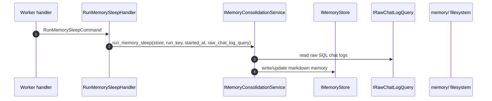

# Memory Write Flow

このドキュメントは、現行実装における memory の更新経路をまとめたものです。
ここでいう update は、会話ログの保存ではなく、memory の長期保存層や
定期コンソリデーションを指します。

## 現行の書き込み系

現時点でアプリケーション層から実際に使われている memory の更新経路は、
`memory_sleep` による consolidation です。

- `GenerateContentHandler` は memory を読むだけで、書き込みはしない
- `memory_sleep` は worker から定期実行される
- 実処理は `IMemoryConsolidationService` に委譲される

## memory_sleep の流れ

### 実装上の入口

- worker 側の入口は [`run_memory_sleep_scheduled_task`](/C:/repos/discord-bot-template/src/app/presentation/worker/handlers/memory_sleep_handlers.py)
- そこから [`RunMemorySleepHandler`](/C:/repos/discord-bot-template/src/app/usecases/memory/run_memory_sleep.py)
  を呼ぶ
- [`RunMemorySleepHandler`](/C:/repos/discord-bot-template/src/app/usecases/memory/run_memory_sleep.py)
  は `memory-sleep:<YYYY-MM-DD>` の `run_key` で処理対象を識別する
- 実処理は [`IMemoryConsolidationService.run_memory_sleep(...)`](/C:/repos/discord-bot-template/src/app/contracts/ports/memory_consolidation.py)
  に委譲される

### 何を更新するか

`memory_sleep` は raw SQL chat logs を材料にして、日次または抽象化された
memory を更新するための処理です。

この層での更新対象は、Markdown + YAML front matter で保存される
長期 memory です。保存形式の詳細は
[`docs/infrastructure/memory_markdown_schema.md`](/C:/repos/discord-bot-template/docs/infrastructure/memory_markdown_schema.md)
を参照してください。

## 読み取りとの分離

[`GenerateContentHandler`](/C:/repos/discord-bot-template/src/app/usecases/chat/generate_content.py)
は [`RetrieveMemoryContextQuery`](/C:/repos/discord-bot-template/src/app/usecases/memory/retrieve_memory_context.py)
を通じて memory を読むだけで、書き込みはしません。

つまり、現行実装では次の分離があります。

- read: `GenerateContentHandler` -> `RetrieveMemoryContextQuery` -> `IMemoryService.retrieve(...)`
- write: `memory_sleep` -> `RunMemorySleepHandler` -> `IMemoryConsolidationService.run_memory_sleep(...)`

## 補足

- presentation 層は memory storage を直接操作しない
- `FilesystemMemoryService()` は初期化時に agent profile がなければ自動生成する
