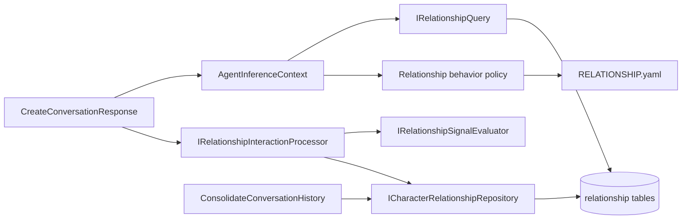
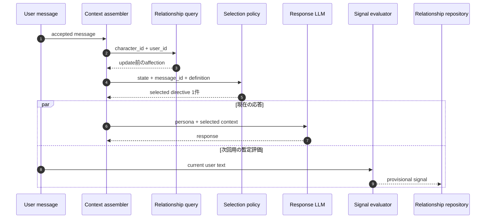

# Relationship System

> 本書は好感度基盤の技術的な正本である。業務上の意味は
> [対話相手との関係状態](../product/ubiquitous-language/relationship.md)、処理の完了条件は
> [会話への応答を作成する](../product/application-use-cases/use-cases/create-conversation-response.md)と
> [会話履歴を整理する](../product/application-use-cases/use-cases/consolidate-conversation-history.md)を参照する。

## 設計原則

- AIは関係シグナルを分類するだけで、応答時の行動を選ばない。
- 応答時の行動切り替えは、アプリケーションが関係状態から選んだコンテキストをLLMへ渡すことで実現する。
- 好感度の正本はSQLの`character_relationships`であり、Markdown memoryやプロンプト内の推測値ではない。
- 状態、会話、シグナル、日次対象は`character_id`と`user_id`で隔離する。
- 関係行動コンテキストは人格プロンプトと安全制約より低い優先度の、一ターン限りの追加方針である。

## 依存境界



アプリケーション境界は`src/app/contracts/ports`、複数レイヤーで共有する関係DTOは
`src/app/contracts/messages/relationship.py`、関係集約と共通段階は
`src/app/domain/aggregates/character_relationship.py`に置く。SQLAlchemy実装はinfrastructureから
これらの契約へ依存する。

## 関係状態

`CharacterRelationship`は次を保持する。

| 項目 | 意味 |
|---|---|
| `character_id` | キャラクター境界 |
| `user_id` | canonical user境界 |
| `affection` | `0`–`100`の整数。初期値`0` |
| `version` | compare-and-swapに使う楽観ロックversion |
| `created_at` / `updated_at` | 状態の作成・更新時刻 |

主キーは`(character_id, user_id)`である。読み取り時に行が存在しなければ、永続化前でも
`affection=0`、`version=1`の初期ビューを返す。

共通8段階と範囲はドメインで固定し、キャラクター定義側で変更しない。段階名と範囲は
[対話相手との関係状態](../product/ubiquitous-language/relationship.md#共通の関係段階)を参照する。

## キャラクター関係定義

各キャラクターは次のパスに`RELATIONSHIP.yaml`を持つ。

```text
memory/profiles/agent/<character_id>/RELATIONSHIP.yaml
```

定義には次を必須とする。

- 正の`schema_version`
- `strong_negative=-5`、`negative=-2`、`neutral=0`、`positive=1`、`strong_positive=3`に対応する5シグナル
- 共通8段階を重複なく一つずつ
- 各段階の説明
- 重み`4`の`neutral`候補一つ
- 重み`2`のキャラクター固有候補三つ

Pydanticは未知キー、欠落段階、重複ID、非正重み、不完全なシグナル集合を拒否する。プロファイルbundleは
起動時に読み取られるため、不正な定義はフォールバックせず起動エラーになる。

現在の定義:

- `memory/profiles/agent/shirasagi-reina/RELATIONSHIP.yaml`
- `memory/profiles/agent/kurose-marina/RELATIONSHIP.yaml`

## 応答時のコンテキスト選択



選択seedは次の値を区切ってSHA-256へ渡す。

```text
character_id, user_id, message_id, relationship_schema_version
```

digestを候補の総重みで剰余し、累積重みへ写像する。Pythonのグローバル乱数を使わないため、同じターンの
再構築、tool実行後の再入場、プロセス再現でも同じ候補になる。初期版は連続選択を許容し、選択履歴や
クールダウンを保存しない。

LLMへ渡す関係コンテキストには選択済みinstructionだけを含め、次を含めない。

- 好感度の数値
- 関係段階ID
- 未選択候補
- 抽選weight

## 即時シグナル

即時評価は応答生成と並行するが、コンテキスト読み取り後に行う。このため現在の応答は更新前状態、
暫定シグナル保存後の次回応答は更新後状態を使う。

評価候補が`neutral`、または信頼度が`0.8`未満ならイベントを保存しない。評価・永続化・commitが失敗しても
会話応答は失敗させず、構造化ログを残す。日次処理は未処理chatから後で回収できる。

イベントIDはキャラクター、利用者、シグナル種別、状態、正規化済み根拠chat ID集合からSHA-256で作る。
同じ判定の再実行は同じIDへupsertし、同じ根拠に別の暫定判定があれば旧イベントを`superseded`へ移す。

## 日次照合

`ConsolidateConversationHistory`は、保存済み`character_id`で対象会話を分離し、JST日単位で処理する。
一度の意味抽出からmemory更新案、全source評価、確定関係シグナルを得る。

確定処理は次の順で行う。

1. 評価対象chatと重なる有効な暫定・確定イベントを特定する。
2. 今回と同一IDの確定イベントを除き、旧イベントを`superseded`へ変更する。
3. 今回の確定イベントと正規化した根拠chat IDをupsertする。
4. 全有効イベントを`observed_at, id`順に読み直す。
5. JST日単位の上昇`+5`、低下`-10`と、全体範囲`0`–`100`を適用する。
6. 各イベントの`applied_delta`と関係スナップショットを更新する。
7. memory更新の成功後、関係状態更新とchat処理済み記録を同じUnit of Workでcommitする。

確定判定が訂正された場合も現在値へ逆差分を当てず、全有効イベントから再計算する。関係更新または
memory更新に失敗したchatは処理済みにせず、再実行可能なまま残す。memoryはファイル保存、関係状態と
処理済み記録はSQLトランザクションであるため、SQL側の確定に失敗した場合は冪等なmemory更新を含めて再実行する。

## 楽観ロック

スナップショット更新は次のcompare-and-swap条件を使う。

```sql
UPDATE character_relationships
SET affection = :affection, version = :next_version
WHERE character_id = :character_id
  AND user_id = :user_id
  AND version = :expected_version;
```

更新件数が1でなければversion競合として扱い、そのトランザクションを成功させない。呼び出し側は対象chatを
未処理のまま残し、最新状態を使った再実行を可能にする。

## 永続化スキーマ

Migration `202607151500_add_character_relationships.py`が次を追加する。

| テーブル | 正本・役割 |
|---|---|
| `chats.character_id` | 受付、履歴取得、日次抽出のキャラクター境界。既存chatは`shirasagi-reina`へ移行 |
| `character_relationships` | キャラクター×利用者の現在スナップショット |
| `relationship_signal_events` | シグナル種別、状態、信頼度、提案差分、適用差分、理由、観測時刻 |
| `relationship_signal_sources` | イベントと根拠chat IDの正規化関連 |

旧`trust_score`、`warmth_score`、Markdown relationship Entityは移行せず、全関係を`0`から開始する。

## 安全境界と対象外

- 関係コンテキストは創作上の感情表現だけを変化させ、操作、脅迫、現実の追跡を指示しない。
- 録音、撮影、監視、訪問、ローカルネットワーク探索を外部機能なしで実行済みとして語らせない。
- 好感度によるtool解禁、ローカルネットワーク連携、他パラメーター、動的キャラクター切替は対象外である。

## 検証対象

- 全段階境界と値域
- JST日跨ぎ、日次上昇・低下上限
- 暫定から確定への置換、確定結果の訂正、重複根拠、再実行
- 楽観ロック競合
- seed再現性、重み境界、tool再入場時の同一選択
- レイナとマリナの状態・履歴・シグナル分離
- 両キャラクター定義の正常読込と不正schemaの起動失敗
- migration upgrade/downgradeと既存chatの割当
